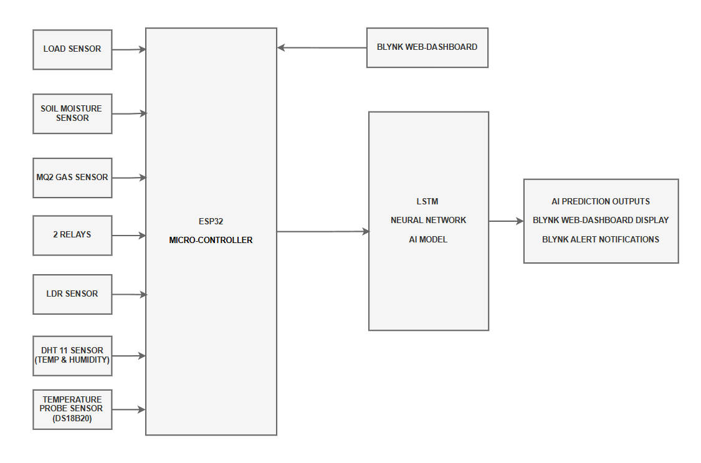
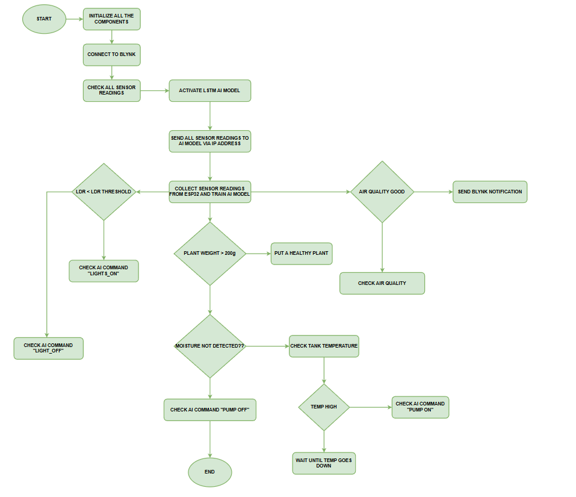
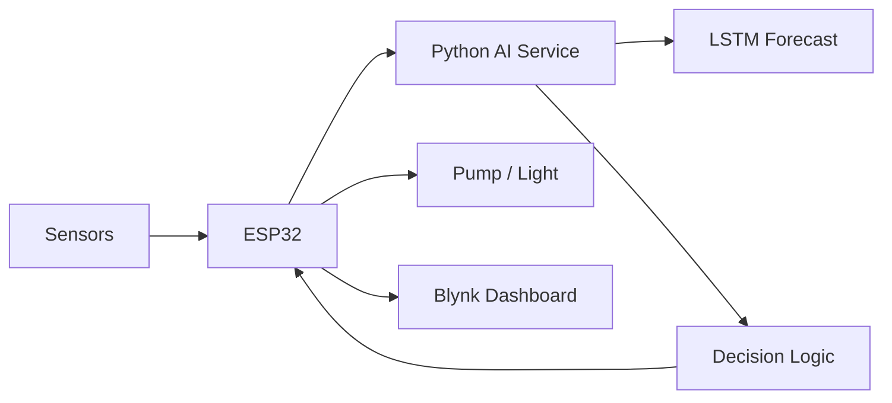

# Smart AI Plant Monitoring & Control

<p align="center">
  <strong>AI-assisted plant monitoring with ESP32 sensing, forecasting, and actuator control</strong>
</p>

<p align="center">
  
  
  
</p>

## Project at a Glance

| Item | Details |
|---|---|
| Domain | Smart agriculture / IoT |
| Controller | ESP32 |
| AI approach | LSTM time-series prediction |
| Monitoring | Soil, gas, light, temperature, humidity, water temperature, weight |
| Actuation | Pump and lighting |
| Cloud | Blynk |
| Status | Academic engineering prototype |

## Overview

The system combines a multi-sensor ESP32 node with a Python prediction service. Sensor history is used to train and update an LSTM-oriented forecasting workflow, while deterministic rules control irrigation and lighting.

## System Design

<p align="center">
  
  
</p>

## Example Output

<p align="center">
  
</p>

## Architecture



## Technology Stack

- ESP32 / Arduino C++
- Python
- TensorFlow / Keras
- NumPy
- Blynk
- DHT11
- DS18B20
- HX711 / load cell
- MQ2
- LDR
- Soil-moisture sensor

## Repository Structure

```text
Smart_AI_Plant/
├── code/
│   ├── Smart_AI.py
│   ├── SMART/SMART.ino
│   ├── ai_model.h5
│   └── sensor_data.csv
├── components/
├── results/
├── BLOCK.drawio
├── FLOW.drawio
├── Fritzing_file.fzz
├── requirements.txt
└── .gitignore
```

## Security

Public firmware contains placeholders for Wi-Fi and Blynk credentials. Real secrets should remain outside version control.

## Future Work

- Separate runtime configuration from source
- Improve time-series validation
- Replace raw sockets with MQTT
- Add model versioning
- Add fail-safe actuator rules
- Build a unified dashboard
- Add automated tests

## Author

**Sadik Shaik**

Computer Engineering · Artificial Intelligence · IoT
